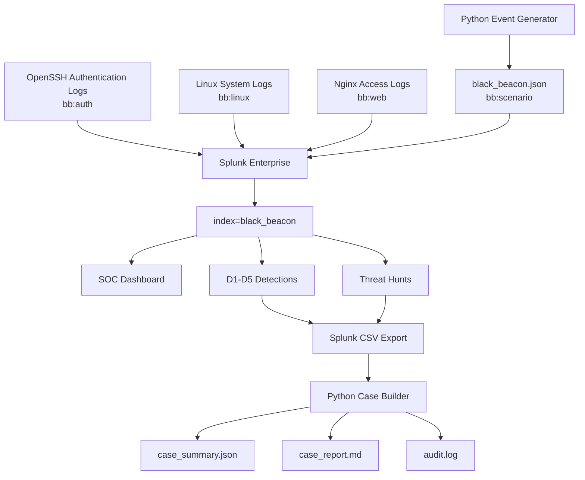
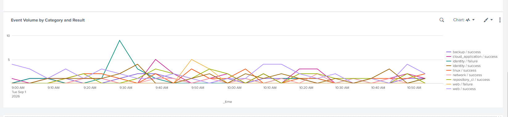
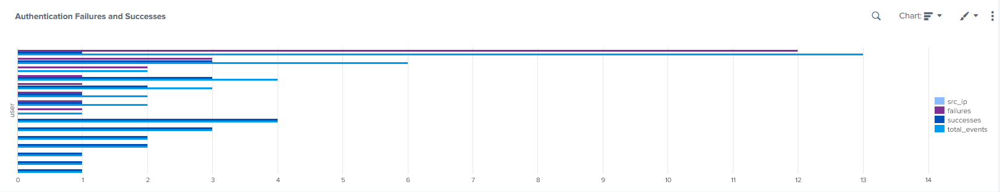
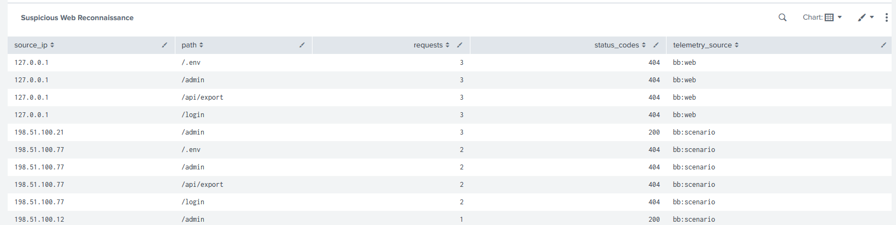
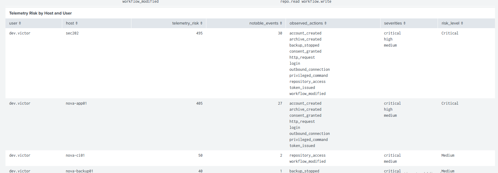
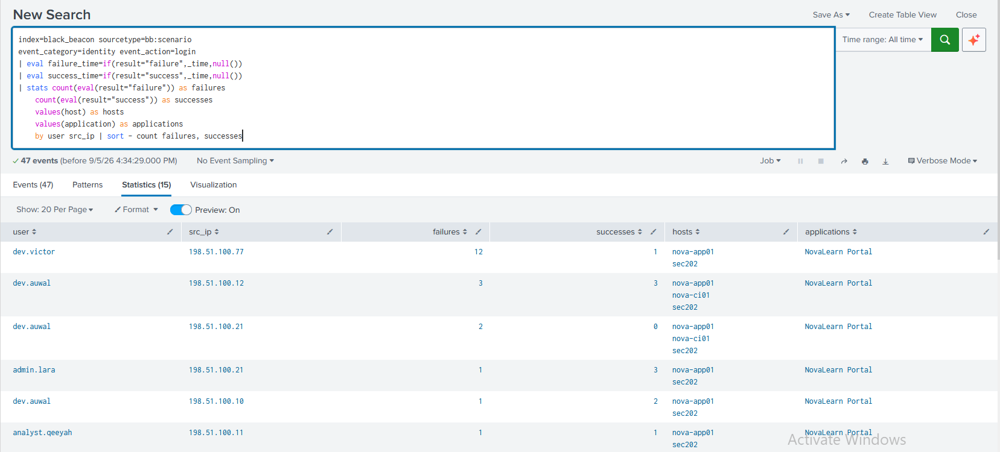
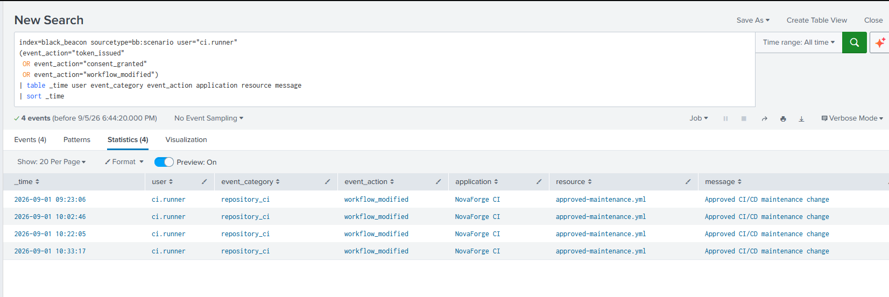
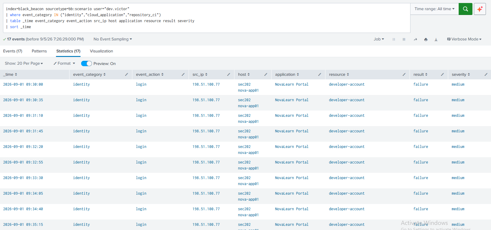

# Operation Black Beacon

> **A mini Splunk-based SOC for detection engineering, threat hunting, incident investigation, MITRE ATT&CK mapping, and Python case triage.**

Operation Black Beacon is a defensive security engineering project built to demonstrate an end-to-end SOC workflow inside a controlled Ubuntu lab.

Rather than treating SIEM monitoring, detection engineering, threat hunting, and automation as separate exercises, this project connects them into one incident-response pipeline:

```text
Telemetry Generation
        |
Splunk Ingestion
        |
SOC Dashboard
        |
Detection Engineering
        |
Threat Hunting
        |
Incident Reconstruction
        |
MITRE ATT&CK Mapping
        |
Python Case Triage
```

---

## Project Highlights

* Built a Splunk Enterprise mini-SOC on Ubuntu
* Generated **200 deterministic synthetic security events**
* Ingested four telemetry sources into `index=black_beacon`
* Built a six-panel SOC investigation dashboard
* Engineered five behavioural SPL detections
* Conducted two hypothesis-driven threat hunts
* Reconstructed a multi-stage intrusion timeline
* Mapped observed behaviour to MITRE ATT&CK
* Built a Python case builder for automated risk scoring and analyst reporting
* Tested malicious, benign, and malformed data
* Used benign testing to identify and reduce false-positive behaviour

---

## Architecture

The environment combines real local Linux/Nginx telemetry with safely generated synthetic attack events.

For the full architecture and data-flow explanation, see:

**[Architecture Documentation](architecture/README.md)**



---

## Technology Stack

| Area               | Technology                         |
| ------------------ | ---------------------------------- |
| SIEM               | Splunk Enterprise                  |
| Operating System   | Ubuntu Linux                       |
| Authentication     | OpenSSH                            |
| Web Telemetry      | Nginx                              |
| Scripting          | Python 3                           |
| Detection Language | Splunk SPL                         |
| Threat Framework   | MITRE ATT&CK                       |
| Data Format        | JSON Lines / CSV / JSON / Markdown |
| Version Control    | Git / GitHub                       |

---

# Synthetic Incident Dataset

Created a custom Python generator to reproduce security dataset containing:

| Classification     |  Events |
| ------------------ | ------: |
| Normal             |     150 |
| Suspicious         |      30 |
| Benign distractors |      20 |
| **Total**          | **200** |

The generator uses seed:

```text
9022026
```

Using the same seed reproduces the same event sequence.

The scenario includes telemetry from:

* identity
* Linux/security
* web
* cloud/application
* repository/CI-CD
* network
* backup activity

A small public sample is available in:

**[`sample-data/`](sample-data/)**

The complete dataset can be regenerated locally using:

```bash
python3 generator/black_beacon_generator.py \
  --output black_beacon.json \
  --seed 9022026
```

---

# Simulated Intrusion

The fictional incident begins with compromise of a developer identity and progresses through several stages:

```text
Repeated failed logins
        |
Successful authentication
        |
Application token / consent activity
        |
Repository access
        |
CI/CD workflow modification
        |
Web reconnaissance
        |
Privileged Linux activity
        |
Local account creation
        |
Archive creation
        |
Outbound communication
        |
Backup interference
```

The primary fictional identity used in the scenario is:

```text
dev.victor
```

All network indicators use documentation-only address ranges such as:

```text
192.0.2.0/24
198.51.100.0/24
203.0.113.0/24
```

No public infrastructure is targeted.

---

# Splunk Data Pipeline

The dedicated Splunk index is:

```spl
index=black_beacon
```

Four principal source types are used:

| Sourcetype    | Purpose                          |
| ------------- | -------------------------------- |
| `bb:auth`     | Linux authentication telemetry   |
| `bb:linux`    | Linux system/security telemetry  |
| `bb:web`      | Nginx access telemetry           |
| `bb:scenario` | Black Beacon telemetry |

Splunk configuration files are available in:

**[`splunk/configs/`](splunk/configs/)**

---

# SOC Dashboard

The dashboard provides six investigation views covering:

1. Event volume over time
2. Authentication failures and successes
3. Suspicious web reconnaissance
4. Linux privilege/account/archive activity
5. Cloud, repository, and CI/CD activity
6. Telemetry risk prioritisation

Dashboard source:

**[`splunk/dashboard/`](splunk/dashboard/)**

### Dashboard Views

<p align="center">
  
  
</p>

<p align="center">
  
  
</p>

---

# Detection Engineering

Five SPL detections were developed.

| ID | Detection                              | Core Behaviour                                                 |
| -- | -------------------------------------- | -------------------------------------------------------------- |
| D1 | Password Attack - Valid Access         | Repeated failures followed by successful authentication        |
| D2 | Identity - CI/CD Compromise            | Token/consent activity followed by CI/CD modification          |
| D3 | Web Reconnaissance                     | Repeated probing of sensitive paths                            |
| D4 | Collection - Outbound Transfer         | Archive creation followed by outbound communication            |
| D5 | Persistence / Operational Interference | Privileged action, local account creation, and backup interruption |

Full detection documentation and SPL:

**[`splunk/detections/`](splunk/detections/)**

---

## D1 - Password Attack - Valid Access

D1 identifies repeated authentication failures followed by successful access for the same user and source IP within 15 minutes.

Example result:

```text
User:       dev.victor
Source IP:  198.51.100.77
Failures:   12
Successes:  1
```

The detection threshold is deliberately lower than the exact attack count to avoid overfitting the rule to the synthetic dataset.

<p align="center">
  
</p>

MITRE ATT&CK:

* **T1110.001 — Password Guessing**
* **T1078 — Valid Accounts**

---

## D2 - Identity - CI/CD Compromise

D2 correlates application token with subsequent CI/CD workflow modification by the same identity.

```text
Token issued
      |
Consent granted
      |
Repository activity
      |
CI/CD modification
```

<p align="center">
  
</p>

MITRE ATT&CK:

* **T1528 - Application Access Token**

---

## Detection Engineering Method

Each rule followed the same engineering process:

```text
Define behaviour
      |
Write SPL
      |
Positive test
      |
Benign / negative test
      |
False positive analysis
      |
Tune correlation / threshold
      |
Document limitations
```

---

# Threat Hunting

Two hypothesis-driven hunts were conducted.

Full hunt documentation:

**[`splunk/hunts/`](splunk/hunts/)**

---

## Hunt 1 — Cross-System Identity Abuse

**Hypothesis**

A single compromised developer identity was used across authentication, application, repository, and CI/CD activity.

### Result

The hypothesis was supported with **high confidence**.

The same identity was observed across:

```text
Authentication
      |
Token / consent activity
      |
Repository access
      |
CI/CD modification
```

---

## Hunt 2 - Persistence and Operational Impact

**Hypothesis**

The compromised identity performed collection, persistence-like activity, outbound transfer, and backup interference.

### Findings

* Privilege activity - observed
* Local account creation - observed
* Archive creation - observed
* Backup interruption - observed
* Possible exfiltration - observed, but not confirmed

An outbound connection following archive creation supports an exfiltration hypothesis but does **not** prove that data was transferred.

<p align="center">
  
</p>

---

# MITRE ATT&CK Coverage

| Technique | Name                           | Evidence                         | Coverage    |
| --------- | ------------------------------ | -------------------------------- | ----------- |
| T1110.001 | Password Guessing              | Repeated authentication failures | D1 / Hunt 1 |
| T1078     | Valid Accounts                 | Success after repeated failures  | D1 / Hunt 1 |
| T1528     | Application Access Token       | Token activity                   | D2 / Hunt 1 |
| T1136.001 | Local Account                  | `svc-beacon` creation            | D5 / Hunt 2 |
| T1560.001 | Archive via Utility            | `learner_export.tar.gz`          | D4 / Hunt 2 |
| T1490     | Inhibit System Recovery        | Backup interruption              | D5 / Hunt 2 |

Full mapping:

**[`threat-intelligence/attack_mapping.md`](threat-intelligence/attack_mapping.md)**

---

# Python Case Builder

The second Python component transforms exported Splunk results into a structured analyst case.

```text
Splunk
   |
alerts.csv
   |
Input validation
   |
Behavioural correlation
   |
Risk scoring
   |
Case package
```

The tool produces:

```text
case_summary.json
case_report.md
audit.log
```

Example execution:

```bash
python3 automation/black_beacon_case_builder.py \
  automation/sample-inputs/alerts_sample.csv \
  BB-DEMO-01 \
  --output-dir automation/sample-outputs/demo
```

The simulated malicious case produced:

```text
Risk Score: 155
Risk Level: Critical
```

<p align="center">
  
</p>

Sample input/output:

**[`automation/sample-inputs/`](automation/sample-inputs/)**
**[`automation/sample-outputs/`](automation/sample-outputs/)**

---

# Testing and Tuning
One of the most useful findings in this project came from benign testing.

The first case-scoring implementation assigned an excessively high score to benign activity.

Instead of hiding the result, the scoring logic was reviewed and redesigned.

The original logic treated some isolated suspicious looking events independently.

The tuned implementation places greater emphasis on:

* shared identity
* shared host context
* event ordering
* temporal correlation
* required attack thresholds

This moved the scoring model from:

```text
Suspicious-looking event
      |
Add risk
```

toward:

```text
Related behaviour
      +
shared context
      +
correct sequence
      +
time correlation
      |
Add risk
```

This test-and-tune cycle reflects an important detection engineering principle:

> **A rule that detects malicious activity but consistently misclassifies benign behaviour is not finished.**

---

# Repository Structure

```text
operation-black-beacon/
|-- README.md
|-- architecture/
|   |-- README.md
|-- generator/
|   |-- black_beacon_generator.py
|-- sample-data/
|   |-- README.md
|   |-- black_beacon_sample.jsonl
|-- splunk/
|   |-- README.md
|   |-- configs/
|   |-- dashboard/
|   |-- detections/
|   |-- hunts/
|-- automation/
|   |-- black_beacon_case_builder.py
|   |-- sample-inputs/
|   |-- sample-outputs/
|-- threat-intelligence/
|   |--attack_mapping.md
|-- screenshots/
|-- .gitignore
```

---

# Reproducing the Lab

## 1. Generate telemetry

```bash
python3 generator/black_beacon_generator.py \
  --output black_beacon.json \
  --seed 9022026
```

## 2. Configure Splunk

Use the examples under:

```text
splunk/configs/
```

Adjust the public example monitor path to the actual location of `black_beacon.json`.

## 3. Validate ingestion

Example:

```spl
index=black_beacon
| stats count by sourcetype
```

## 4. Test detections

Open any SPL file under:

```text
splunk/detections/
```

and run it against the project index.

## 5. Run the case builder

```bash
python3 automation/black_beacon_case_builder.py \
  automation/sample-inputs/alerts_sample.csv \
  BB-DEMO-01 \
  --output-dir automation/sample-outputs/demo
```

---

# Security and Ethics

Operation Black Beacon was designed as a defensive security project.

The public repository intentionally excludes:

* real credentials
* personal data
* live malicious infrastructure
* destructive automation
* public-target scanning
* unnecessary raw logs
* academic submission material

Potentially disruptive behaviour such as persistence, backup interference, and exfiltration is represented safely through synthetic events.

The Python case builder is **advisory only**.

It does not automatically:

* disable users
* revoke accounts
* block IP addresses
* stop services
* delete files

Disruptive containment actions should remain subject to analyst approval.

---

# Key Lessons

This project reinforced several defensive security principles:

### Benign testing matters

Positive testing proves that a detection can fire.

Benign testing helps determine whether it should.

### Evidence precision matters

An outbound connection can support an exfiltration hypothesis without proving that a file was actually transferred.

### Reproducibility matters

Scripts, SPL, configuration files, hashes, and structured outputs provide stronger evidence than screenshots alone.

### Automation should support analysts

Security automation should reduce repetitive work while preserving human judgement for disruptive decisions.

---

# Disclaimer

Operation Black Beacon is a defensive security portfolio project built and tested in a controlled environment.

All identities, indicators, and attack activity are fictional and uses documentation-only address ranges.

This repository is intended for authorised security monitoring, detection engineering, threat hunting, and incident investigation.
