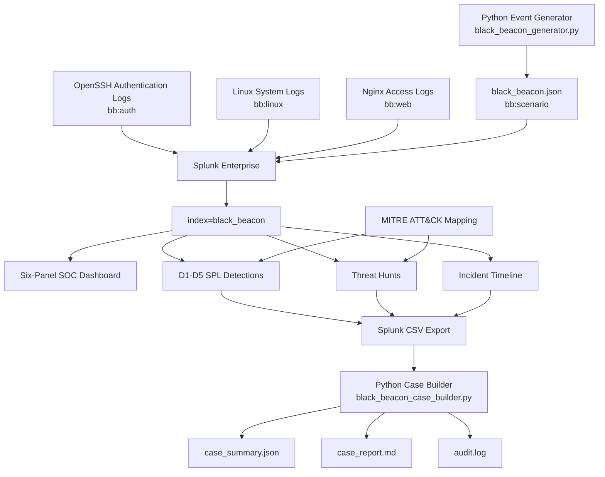

# Operation Black Beacon Architecture

The project uses a lightweight Splunk-based mini-SOC architecture running inside a controlled Ubuntu lab.



## Data Flow

```text
Linux / SSH / Nginx telemetry
            +
Synthetic incident telemetry
            |
      Splunk Enterprise
            |
      index=black_beacon
            |
Dashboard + Detections + Hunts
            |
       Splunk CSV Export
            |
      Python Case Builder
            |
case_summary.json
case_report.md
audit.log
```
